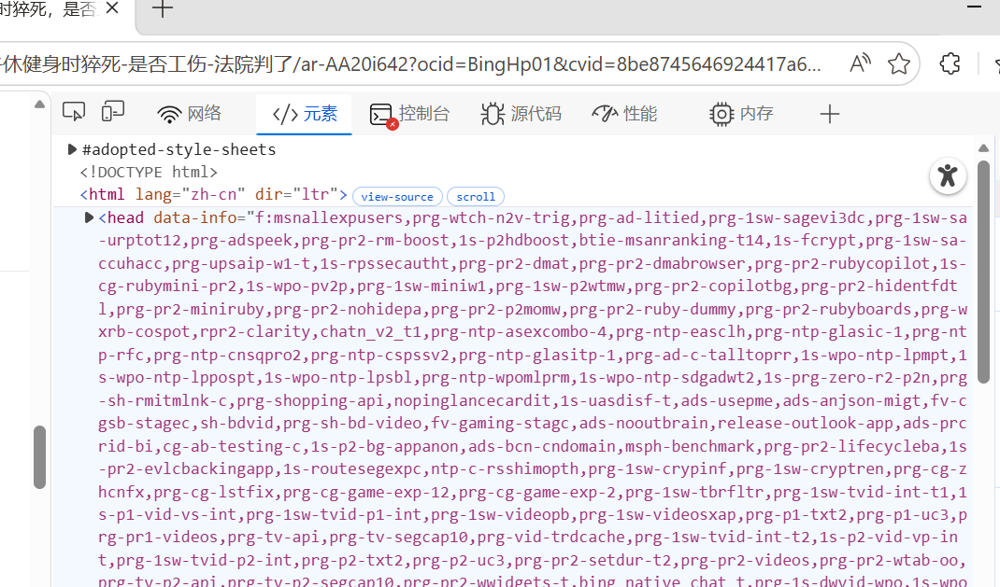
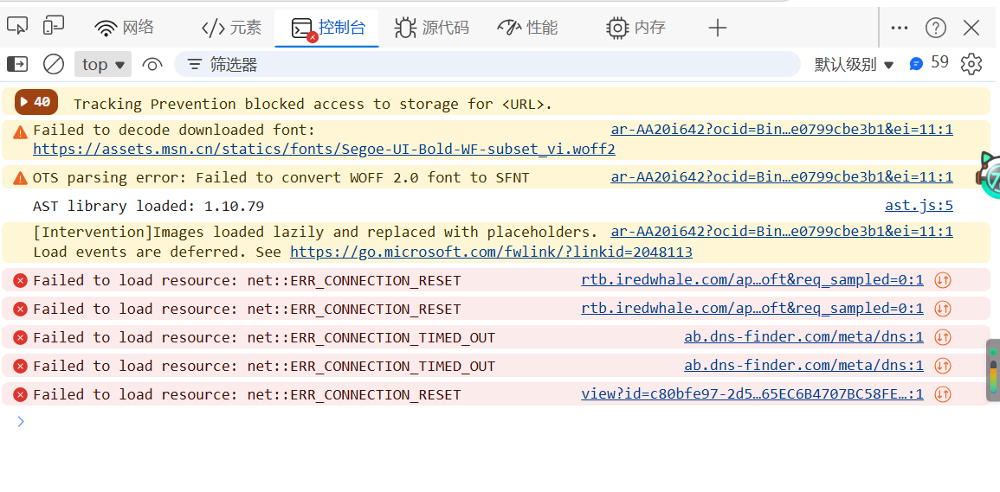
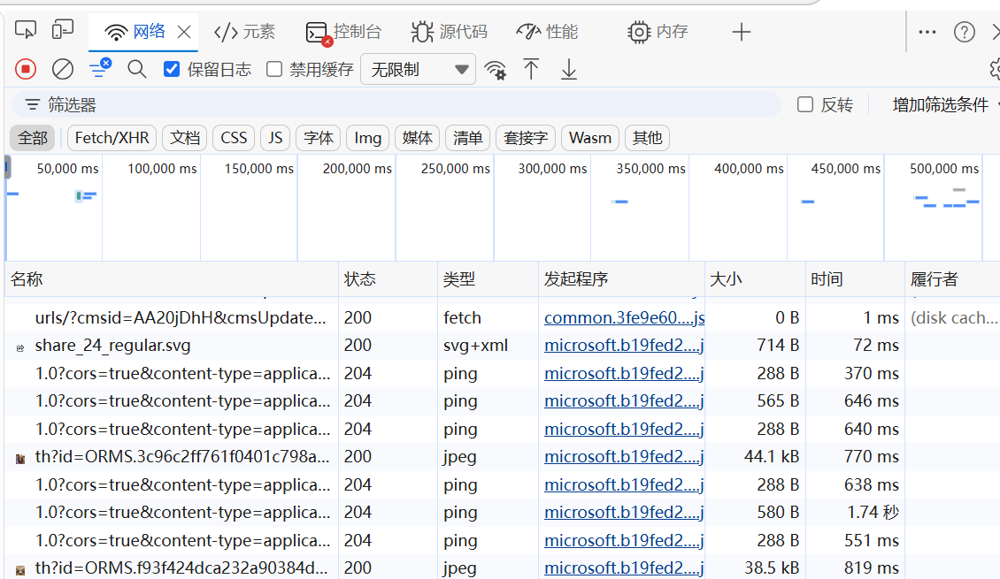
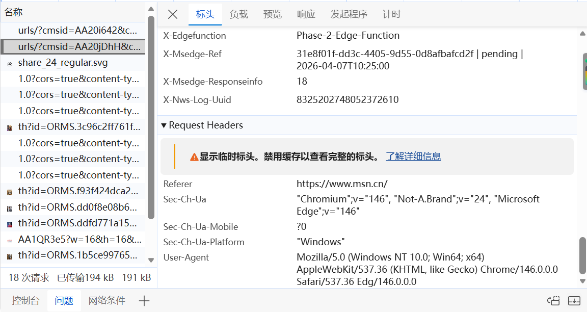
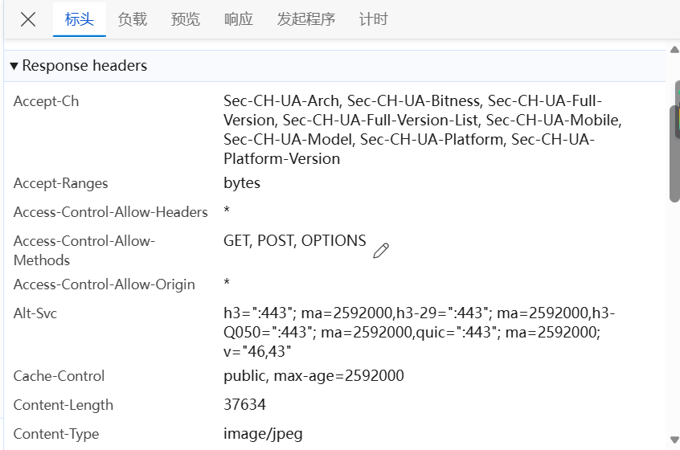
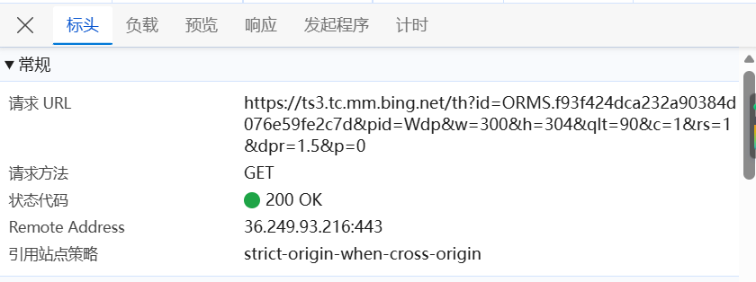
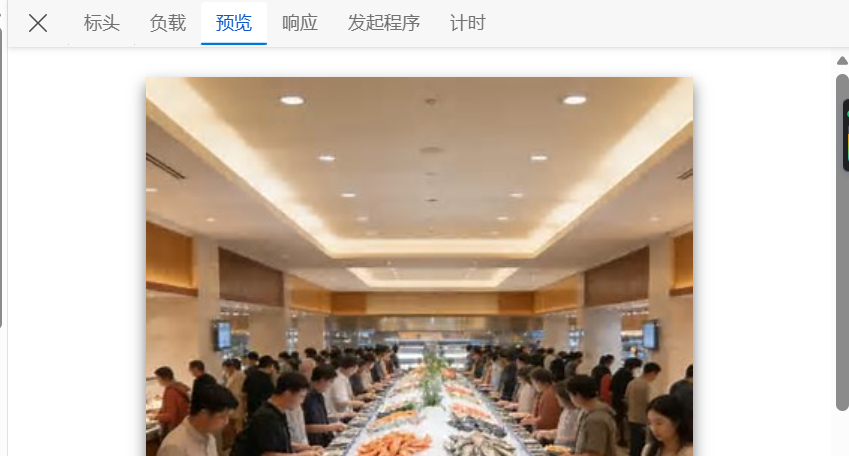
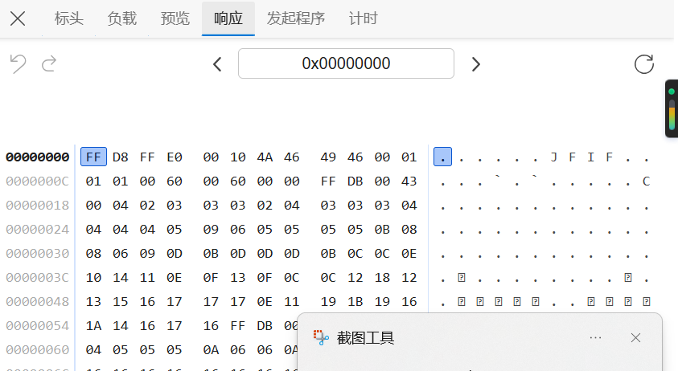
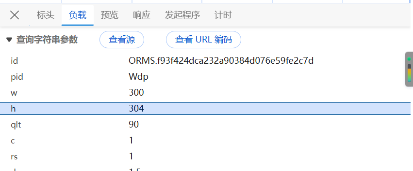

# DevTools

我主要是用Edge，按F12后或者在网页任意元素上点击鼠标右键，选择“检查”后，会弹出抓包工具  


## 元素

元素如上，是网页对应的HTML，可以从上面数据解析到对应的数据

## 控制台



可输入JS代码以进行对应操作

## 网络



是各种网络请求的汇总，注意Fetch/XHR(动态的网络请求都在这里)

### 标头

#### 请求头


从浏览器上获取，在请求时最好加上

```py
header = {
    "User-Agent":"Mozilla/5.0 (Windows NT 10.0; Win64; x64) AppleWebKit/537.36 (KHTML, like Gecko) Chrome/146.0.0.0 Safari/537.36 Edg/146.0.0.0"
}
```

#### content-type


这决定到时候怎么解析  

#### 常规



- URL:看网址
- 请求方法：决定使用的方法
- 状态代码：看请求的状态

### 预览


用来看响应的情况  

### 响应


用来看响应形式

### 负载


用来看URL携带的参数
